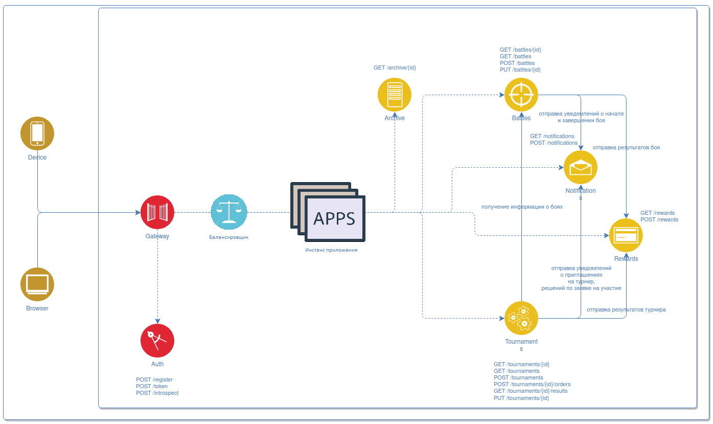

# Домашнее задание № 10
Разработать микросервисную архитектуру для игры Танки

## Цель:
Разбить Игру Танки на набор взаимодействующих между собой микросервисов и приложений.

## Описание/Пошаговая инструкция выполнения домашнего задания:
Представить в виде одной или нескольких диаграмм архитектуру приложения для игры в танки.

### Описание задания:
Танковые бои могут проводить только зарегистрированные пользователи. Танковые бои проводятся как в рамках турниров, либо между любыми пользователями по договоренности.  
Можно посмотреть список будущих турниров, подать заявку на участие в турнире, посмотреть результаты проходящих турниров, уже прошедших.  
Участники боев получают уведомления о приглашении на турнир, решение по заявке на участие в турнире, о завершении танкового боя, о скором начале стартового боя.  
Участник танкового боя может посмотреть прошедший бой. За места в турнире участники получают рейтинговые очки.  
Каждый пользователь может организовать свой турнир. Турниры получают рейтинг, который рассчитывается на основе рейтингов его участников.  
Турнир может быть регулярным, тогда рейтинг его накапливается.  
Игрок участвует в танковом бое посредством программы, которая загружается в специальное приложение Агент.  
Для успешного решения задачи необходимо:
* Определить набор микросервисов и веб-приложений и отобразить их на диаграмме/наборе диаграмм.
* Определить направления обмена сообщениями и Endpoints для каждого микросервиса и приложения.
* Определить узкие места и потенциальные проблемы масштабирования приложения и способы их решения.
* Определить компоненты, к которым чаще всего будут меняться требования, и способы выполнения OCP для них.
* Сделать текстовые пояснения к созданному решению.
  Все документы, составляющие решение, выложить в git.

## Решение:

### Микросервисы:
* gateway (шлюз) - входная точка для клиентского приложения; выполняет роутинг на остальные микросервисы в зависимости от
  полученного запроса (например, по шаблону пути); проверяет наличие токена в запросе клиента.
* auth (авторизация) - отвечает за регистрацию, выдачу токена пользователям. Возможные Endpoints:
    * POST /register - регистрация
    * POST /token - получение токена
    * POST /introspect - проверка токена  
      С авторизацией взаимодействуют все микросервисы (для проверки токена), а также клиент через шлюз (для регистрации и получения токена).
* balancer (балансировщик) - балансировщик нагрузки на ноды, чтобы решить проблему узкого места на ноде при большом количестве боёв/участников
* instance (инстанс приложения) - несколько инстансов приложения, балансровщик выбирает самый не нагруженный инстанс и пересылает в него запрос на создание нового боя/турнира
* tournaments (турниры) - отвечает за организацию танковых боёв - как турниров, так и между пользователями по договорённости. Возможные Endpoints:
    * GET /tournaments/{id} - просмотр турнира
    * GET /tournaments - просмотр списка турниров (с возможными фильтрами по датам)
    * POST /tournaments - организация турнира (или танкового боя по договорённости - в зависимости от переданных параметров)
    * POST /tournaments/{id}/orders - подача заявки на участие в турнире
    * GET /tournaments/{id}/results - просмотр результатов турнира
    * PUT /tournaments/{id} - редактирование турнира  
      Взаимодействует с сервисом battles - для получения информации о боях, входящих в турнир. Направляет в сервис notifications
      приглашения на турнир, решения по заявке на участие в турнире. Направляет в сервис rewards результаты турнира.
* battles (танковые бои) - игровой сервер, в который пользователи направляют команды для конкретного танкового боя; позволяет получить информацию
  о конкретных боях. Возможные Endpoints:
    * GET /battles/{id} - просмотр конкретного боя
    * GET /battles - просмотр списка боёв (с возможными фильтрами)
    * POST /battles - создание боя
    * PUT /battles/{id} - отправка команд  
      Взаимодействует с сервисом notifications - направляет информацию о начале и завершении боя, а также с сервисом rewards - направляет результаты.
* rewards (вознаграждения) - отвечает за начисление рейтинговых очков участников и турниров. Возможные Endpoints:
    * GET /rewards - просмотр рейтинговых баллов пользователя или турнира (в зависимости от переданных параметров)
    * POST /rewards - сохранение статистики для дальнейших расчётов вознаграждений и баллов. В т.ч., может получать данные из очереди.  
      Получает из сервисов tournaments и battles результаты турниров и боёв.
* archive (архив) - позволяет просмотреть прошедшие бои.
    * GET /archive/{id} - просмотр прошедшего боя.  
      Обращается к той же БД, что и сервис battles (возможно, к cold-ноде или реплике).
* notifications (уведомления) - отвечает за обработку уведомлений пользователям. Возможные Endpoints:
    * GET /notifications - просмотр списка уведомлений пользователю
    * POST /notifications - создание уведомления. В т.ч., может получать данные об уведомлениях из очереди.  
      Получает информацию об уведомлениях из сервисов tournaments и battles. Направляет уведомления пользователю - возможно, с
      использованием email, мессенджеров, firebase.

### Узкие места:
* gateway - через него идёт всё общение клиента со всей системой. Следует увеличить количество экземпляров для повышения надёжности.
* auth - без токенов невозможен доступ к функционалу. Для повышения надёжности следует увеличить количество экземпляров, возможно,
  добавить кэширование пользователей (чтобы существующие пользователи могли продолжать пользоваться функционалом), продумать
  наиболее оптимальный срок жизни токена (чтобы пользователям не приходилось слишком часто получать новый).
* archive - одновременно может загружаться слишком много информации из архива. Для этого следует предусмотреть отдельную ноду БД для архива.
  Следует обращаться к readonly реплике (там могут быть не самые актуальные данные). Старые данные хранить на cold нодах. Обращение к архиву
  не должно мешать записи и получению текущих данных.

### Компоненты, к которым чаще всего будут меняться требования:
Чаще всего будут меняться требования к tournaments (правила, организация проведения и регистрации на турниры) и battles
(правила проведения танковых боёв). Для выполнения принципа открытости-замкнутости следует продумать архитектуру так, чтобы
не менять уже созданный код. Для этого использовать интерфейсы, чтобы была возможность впоследствии подменять реализации.
Для зависимостей следует использовать IoC-контейнер. Необходимые алгоритмы настраивать с помощью стратегий.  
Будут появляться новые настройки, объекты и способы взаимодействия между ними. Для этого будут создаваться новые команды
(без изменения существующего кода) и стратегии.

### Схема:
